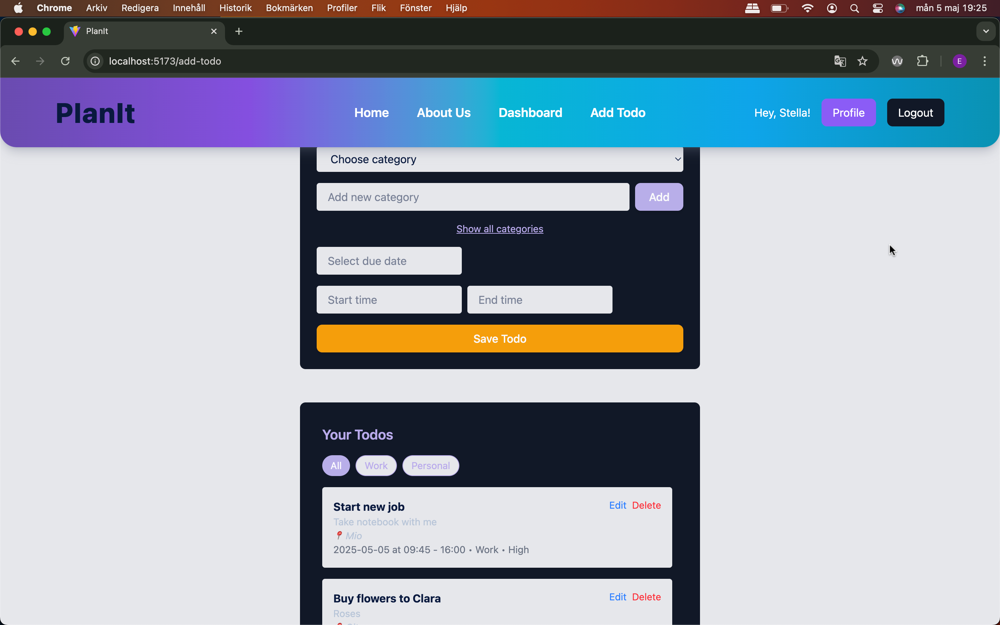
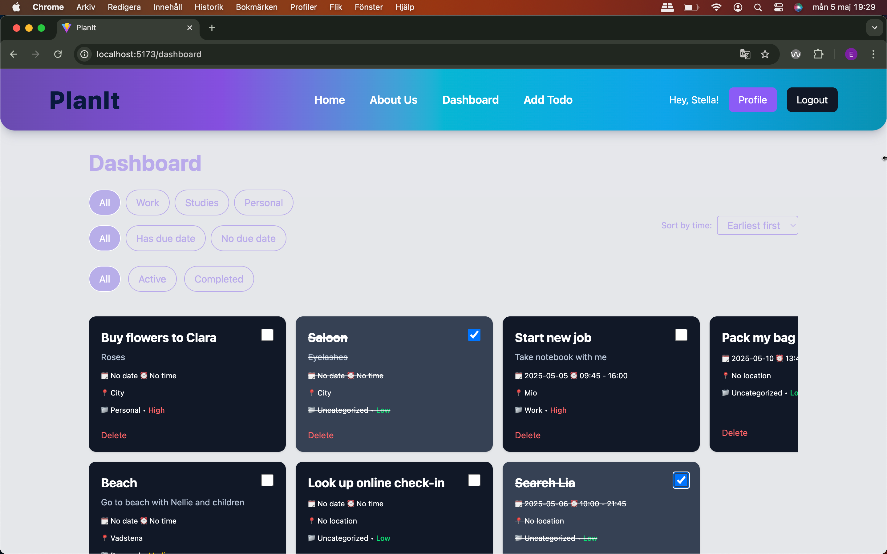
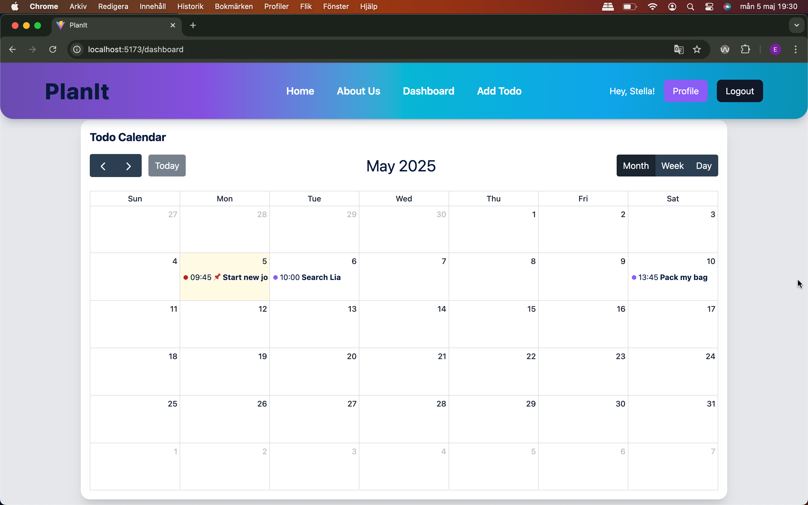

# PlanIt
PlanIt





## Overview
This is a full-stack application designed to manage tasks and reminders. The app is built with **React (Vite)** on the frontend, **Node.js (Express)** on the backend, and **MongoDB** for data storage. It also uses **Tailwind CSS** for styling and **Redux Toolkit** for state management. The app allows users to sign up, log in, and manage their tasks.

## Technologies Used
- **Frontend**: React (Vite), Tailwind CSS, Redux Toolkit
- **Backend**: Node.js, Express
- **Database**: MongoDB
- **Authentication**: JWT (JSON Web Tokens)
- **Email Service**: Gmail (for subscription confirmation and password reset emails)

## Setup

### 1. Clone the repository
Clone the repository to your local machine:
```bash
git clone https://github.com/yourusername/portfolio-app.git
cd portfolio-app
```

### 2. Backend Setup

#### Install Dependencies
Navigate to the `backend` folder and install the necessary dependencies:
```bash
cd backend
npm install
```

#### Create `.env` file
In the `backend` folder, create a `.env` file and add the following environment variables (with your own values):

```dotenv
# MongoDB connection string (from MongoDB Atlas)
MONGO_URI="your-mongo-atlas-url"  # Replace with your MongoDB Atlas connection string
PORT=5000

# Email credentials (for sending subscription emails, registration confirmation, and password reset emails)
EMAIL_USER="your-email@example.com"
EMAIL_PASS="your-email-password"

# JWT Secret Key
JWT_SECRET="your-jwt-secret-key"  # Replace with a secret key for signing JWT tokens

# Frontend URL (usually localhost during development)
FRONTEND_URL="http://localhost:5173"
```

**Important**: Replace the values with your own credentials and information. Never commit or share your `.env` file publicly.

### 3. Frontend Setup

Navigate to the `frontend` folder and install the necessary dependencies:
```bash
cd frontend
npm install
```

Start the frontend development server:
```bash
npm run dev
```

### 4. Run the Application
Once the backend and frontend are running, open your browser and go to `http://localhost:5173` to test the application. The frontend will communicate with the backend running on `http://localhost:5000`.

## Environment Variables

Ensure you have the following environment variables set up for the backend to run properly:

### Example `.env` for Backend:
```dotenv
MONGO_URI="your-mongo-atlas-url"  # Replace with your MongoDB Atlas connection string
PORT=5000

EMAIL_USER="your-email@example.com"
EMAIL_PASS="your-email-password"

JWT_SECRET="your-jwt-secret-key"

FRONTEND_URL="http://localhost:5173"
```


## Running the App in Production

For a production environment, make sure both the backend and frontend are built and deployed correctly.

### Start the Backend
To start backend, run the following command:

```bash
cd backend
npm install
npm run dev
```


## Troubleshooting

If you encounter any issues during setup or while running the app, check the console for error messages. Here are some common troubleshooting tips:

- Make sure MongoDB is properly configured and connected.
- Ensure the `.env` file is correctly set up with all necessary variables.
- Check if the backend server (`http://localhost:5000`) and frontend server (`http://localhost:5173`) are both running.


---
**Note**: Remember to **never** upload your actual `.env` file to a public repository on GitHub. Use `.gitignore` to ignore it from being committed.
